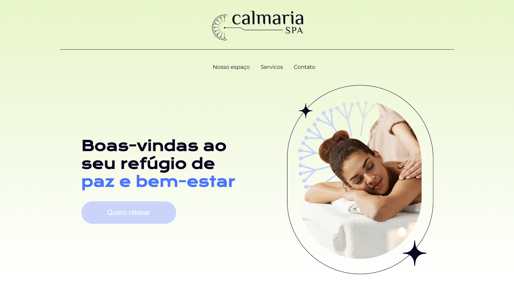
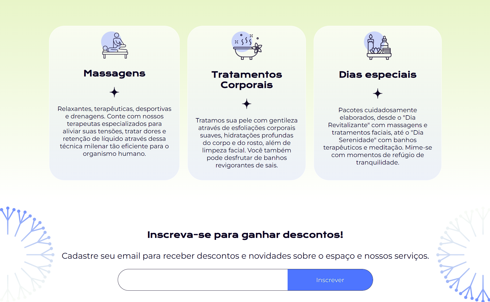
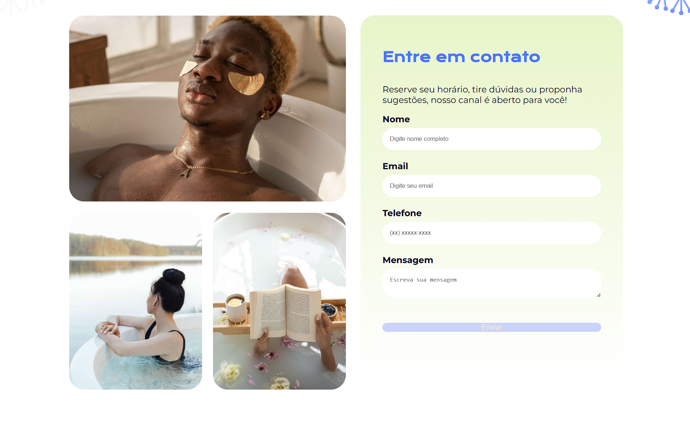

# 🌿 Calmaria Spa

[](https://developer.mozilla.org/en-US/docs/Web/HTML)
[](https://sass-lang.com/)
[](https://developer.mozilla.org/en-US/docs/Web/CSS)
[](https://pereiraferreirarafael.github.io/calmaria-spa)
[](#)

> Landing page responsiva de um espaço de bem-estar, desenvolvida com HTML5 e SCSS — demonstrando domínio de CSS Grid, Flexbox e arquitetura de estilos com Sass.

🔗 **[Ver demo ao vivo →](https://pereiraferreirarafael.github.io/calmaria-spa)**

---

## ✨ Funcionalidades

- Layout responsivo para mobile, tablet e desktop
- Arquitetura de estilos organizada com SCSS (variáveis, mixins, partials)
- Seções estruturadas com CSS Grid e Flexbox
- Tipografia e paleta de cores consistentes
- Animações e transições suaves com CSS puro

---

## 🛠️ Tecnologias

| Tecnologia | Uso |
|------------|-----|
| HTML5 | Estrutura semântica das páginas |
| SCSS/Sass | Estilização modular e reutilizável |
| CSS Grid | Layout das seções principais |
| Flexbox | Alinhamento de componentes internos |
| CSS Animations | Micro-interações e transições |

---

## 📁 Estrutura do Projeto

```
calmaria-spa/
├── index.html          # Página principal
├── assets/
│   └── images/         # Imagens e ícones
└── styles/
    ├── main.scss        # Arquivo principal de estilos
    ├── _variables.scss  # Variáveis globais (cores, fontes, espaçamentos)
    ├── _mixins.scss     # Mixins reutilizáveis
    └── sections/        # Estilos por seção
```

---

## 🚀 Como rodar localmente

```bash
# 1. Clone o repositório
git clone https://github.com/pereiraferreirarafael/calmaria-spa.git
cd calmaria-spa

# 2. Abra no navegador
# Opção A — abrir direto:
open index.html

# Opção B — com Live Server (recomendado para ver mudanças em tempo real):
# Instale a extensão Live Server no VS Code e clique em "Go Live"
```

Para compilar o SCSS localmente:

```bash
# Instale o Sass globalmente
npm install -g sass

# Compile e observe mudanças automaticamente
sass --watch styles/main.scss styles/main.css
```

---

## 📸 Screenshots

**Hero — Boas-vindas ao seu refúgio de paz e bem-estar**


**Serviços — Massagens, Tratamentos Corporais e Dias Especiais**


**Contato — Formulário de agendamento**

---

## 🌐 Deploy (GitHub Pages)

Este projeto está publicado via **GitHub Pages**. Para replicar o deploy no seu fork:

1. Vá em **Settings** → **Pages** no repositório
2. Em **Branch**, selecione `main` e pasta `/root`
3. Clique em **Save** — o site fica disponível em `https://seu-usuario.github.io/calmaria-spa`

---

## 📄 Licença

MIT License — livre para uso e estudo.

---

<div align="center">

Desenvolvido por [Rafael Pereira Ferreira](https://github.com/pereiraferreirarafael) · [LinkedIn](https://www.linkedin.com/in/rafael-pereira-ferreira-7a6836111)

</div>
